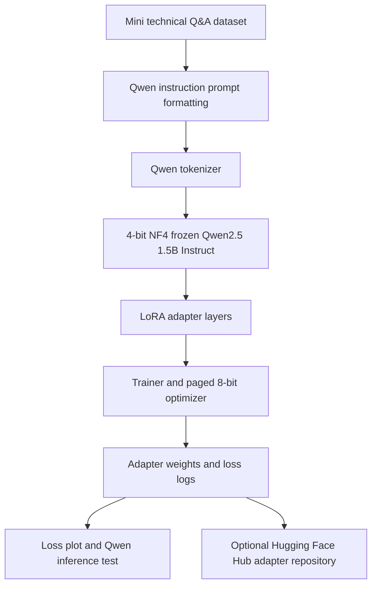

# Day 5 Architecture — Qwen QLoRA

## Component roles

- **Qwen2.5-1.5B-Instruct:** the instruction-tuned base causal language model.
- **Transformers:** Qwen tokenizer, causal language model, Trainer, and text-generation pipeline.
- **bitsandbytes:** 4-bit NF4 quantized loading and memory-efficient optimizer support.
- **PEFT:** prepares the quantized Qwen model and attaches trainable LoRA layers.
- **datasets:** stores and splits the mini Q&A data.
- **Trainer:** runs supervised causal-language-model training and records logs.
- **matplotlib:** plots training and evaluation loss.
- **Hugging Face Hub:** optionally stores the resulting Qwen adapter and tokenizer.

## Training boundary

The Qwen base model parameters are frozen. The notebook trains LoRA matrices attached to attention projections (`q_proj`, `k_proj`, `v_proj`, and `o_proj`). This reduces trainable memory compared with full fine-tuning, but it does not make training free in every environment: GPU availability and service limits are controlled by Colab.

## Access boundary

The Qwen base model used here does not require gated access. A Hugging Face token is optional for public download and required only for pushing the adapter to a Hub repository.

## Output boundary

The uploaded artifact is an adapter, not a full Qwen copy. To use it later, load `Qwen/Qwen2.5-1.5B-Instruct` as the base model and attach the published adapter with PEFT.
