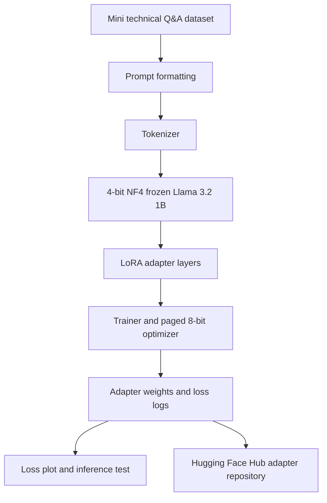

# Day 5 Architecture

## Component roles

- **Transformers:** tokenizer, causal language model, training loop, and text-generation pipeline.
- **bitsandbytes:** 4-bit NF4 quantized loading and memory-efficient optimizer support.
- **PEFT:** prepares the quantized model and attaches trainable LoRA layers.
- **datasets:** stores and splits the mini Q&A data.
- **Trainer:** runs supervised causal-language-model training and records logs.
- **Hugging Face Hub:** stores the resulting adapter and tokenizer.

## Training boundary

The base model parameters are frozen. The notebook trains LoRA matrices attached to attention projections (`q_proj`, `k_proj`, `v_proj`, and `o_proj`). This reduces trainable memory compared with full fine-tuning, but it does not make training free in every environment: GPU availability and service limits are controlled by Colab.
